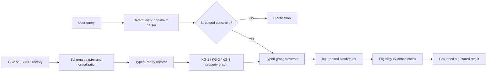

# TRACE Public-Service Retrieval Engine

TRACE is a deterministic, constraint-aware retrieval engine for food-pantry
directories. This repository captures the complete implementation milestone
immediately before LLM integration: source-data ingestion, query constraint
parsing, typed knowledge graphs, grounded retrieval, evidence checks, and
repeatable evaluation.

It is intentionally usable without an API key, hosted model, vector database,
or graph database. The command-line interface returns structured JSON whose
provider facts always come from the loaded directory.

## What is implemented

- Direct ingestion of normalized CSV/JSON files and the original nine-column
  Kansas Food Source export.
- Stable provider IDs, source URLs, and verbatim source evidence.
- A deterministic parser for pantry name, city, county, ZIP code, weekday,
  opening time, and ID-related eligibility constraints.
- Explicit property graphs with typed nodes, edges, properties, indexes, and
  graph traversal for the KG-1, KG-2, and KG-3 ablations.
- Conservative normalization of free-form hours into day/time intervals.
- Batched candidate retrieval followed by evidence-backed semantic filtering.
- Clarification for queries that lack a usable structural constraint.
- CLI commands to ask, inspect, export, and evaluate.
- A validated 1,000-query benchmark and automated tests.

## What is not implemented yet

This milestone is not yet a natural-language chatbot. It has no LLM provider,
prompting layer, embeddings, vector index, generated prose, conversation
memory, HTTP API, or web UI. Its token-overlap score is a deterministic ranking
signal, not an embedding similarity or confidence probability. See
[`docs/pre-llm-status.md`](docs/pre-llm-status.md) for the exact integration
boundary and next work.

## Architecture at a glance



The graph is not a label for field filtering. Query execution resolves graph
nodes, traverses typed incoming edges, intersects provider-ID sets using strict
AND semantics, and ranks only the resulting candidates. Full design details
are in [`docs/architecture.md`](docs/architecture.md) and
[`docs/knowledge_graph.md`](docs/knowledge_graph.md).

## Quick start

Requirements: Python 3.11 or newer. The project has no runtime dependencies.

```powershell
cd trace-public-service
$env:PYTHONPATH = "src"
python -m trace_engine.cli `
  --data data/sample/pantries.csv `
  ask "Find a pantry in Sedgwick County open Monday at 10am without ID" `
  --variant kg3
```

If Windows opens the Microsoft Store or reports that `python` was not found,
use the Python launcher (`py -3.11`) in place of `python`. In a Codex desktop
workspace, the bundled Python executable reported by the workspace runtime can
also be used directly.

Run all tests:

```powershell
$env:PYTHONPATH = "src"
python -m unittest discover -s tests -v
```

Inspect the sample graph:

```powershell
python -m trace_engine.cli `
  --data data/sample/pantries.csv `
  graph --variant kg3
```

Use the original Kansas export without modifying or copying it:

```powershell
python -m trace_engine.cli `
  --data "C:\path\to\KS Pantries.csv" `
  ask "Which pantries in Sedgwick County are open Saturday at 10am?" `
  --variant kg3 --limit 3
```

See [`docs/cli.md`](docs/cli.md) for every command and an explanation of the
JSON response.

## Retrieval variants

| Variant | Graph-backed exact constraints | Candidate ranking |
| --- | --- | --- |
| `kg0` | None | Text overlap across the full directory |
| `kg1` | Pantry name and location | Text overlap within graph-selected location matches |
| `kg2` | Pantry name and operating hours | Text overlap within graph-selected schedule matches |
| `kg3` | Pantry name, location, and operating hours | Text overlap within the intersection of all graph constraints |

## Reproducing the benchmark

The repository contains an evaluation-ready 1,000-query JSONL derivative. The
full 811-row source directory is deliberately not redistributed; point the CLI
at your authorized local copy:

```powershell
$env:PYTHONPATH = "src"
python scripts/validate_benchmark.py `
  --data "C:\path\to\KS Pantries.csv" `
  --source benchmarks/synthetic_1000_source.jsonl `
  --output work/synthetic_1000.validated.jsonl

python -m trace_engine.cli `
  --data "C:\path\to\KS Pantries.csv" `
  evaluate --benchmark benchmarks/synthetic_1000.jsonl --variant kg3 --k 3
```

The measured baseline and its interpretation are in
[`reports/baseline.md`](reports/baseline.md). The scores are implementation
baselines, not a claim of reproducing the paper's final results.

## Grounding and safety contract

Every recommendation contains a complete `Pantry` record selected by stable ID
from the loaded directory. Evidence is copied from source fields; the engine
does not invent providers, hours, eligibility rules, or contact details. A
future LLM layer must treat these structured records as the only allowed source
for rendered provider facts and must preserve the existing clarification path.

## Documentation map

- [`docs/architecture.md`](docs/architecture.md): components and end-to-end data flow.
- [`docs/knowledge_graph.md`](docs/knowledge_graph.md): graph schema, traversal, and hours coverage.
- [`docs/pre-llm-status.md`](docs/pre-llm-status.md): completed work, limitations, and LLM handoff.
- [`docs/cli.md`](docs/cli.md): commands, output fields, and troubleshooting.
- [`docs/reproducibility.md`](docs/reproducibility.md): clean-room verification procedure.
- [`data/README.md`](data/README.md): accepted schemas and source-data policy.
- [`benchmarks/README.md`](benchmarks/README.md): benchmark derivation and validation.
- [`reports/baseline.md`](reports/baseline.md): current real-data results.

## Data and licensing

The sample records are fictional test fixtures. The original Kansas directory
is not included because its redistribution terms have not been documented.
The benchmark JSONL files are research derivatives and should be reviewed
before changing this repository from private to public. No open-source code
license has been selected yet; absent a license, normal copyright restrictions
apply.
