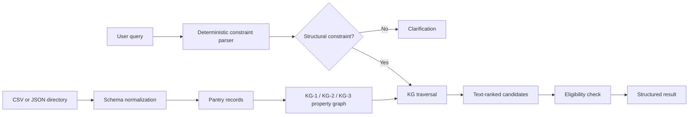

# TRACE Public-Service Retrieval Engine

TRACE is a deterministic, constraint-aware retrieval engine for food-pantry
directories. This repository contains the implementation before LLM integration, i.e., only the 'retrieval' part:

- A deterministic parser for pantry name, city, county, ZIP code, weekday,
  opening time, and ID-related eligibility constraints.
- Explicit knowledge graphs (KGs) with typed nodes, edges, properties, indexes, and
  graph traversal for the KG-1, KG-2, and KG-3 ablations.
- Normalization of free-form hours into day/time intervals.
- Batched candidate retrieval followed by semantic filtering.
- Clarification for queries that lack a usable structural constraint.
- A validated 1,000-query benchmark.

## Architecture at a glance



## Quick start

Requirements: Python 3.11 or newer. The project has no runtime dependencies.

```powershell
cd trace-public-service
$env:PYTHONPATH = "src"
python -m trace_engine.cli `
  --data data/sample/pantries.csv `
  ask "Find a pantry in Sedgwick County open Monday at 10am without ID" `
  --variant kg3
```

If `python` is not found,
use the Python launcher (`py -3.11`) in place of `python`.

Run all tests:

```powershell
$env:PYTHONPATH = "src"
python -m unittest discover -s tests -v
```

Inspect the sample graph:

```powershell
python -m trace_engine.cli `
  --data data/sample/pantries.csv `
  graph --variant kg3
```

Use the original KansasFoodSource dataset without modifying or copying it:

```powershell
python -m trace_engine.cli `
  --data "C:\path\to\KS Pantries.csv" `
  ask "Which pantries in Sedgwick County are open Saturday at 10am?" `
  --variant kg3 --limit 3
```

## Retrieval (KG) variants

| Variant | Graph constraints |
| --- | --- |
| `kg0` | None |
| `kg1` | Pantry name and location |
| `kg2` | Pantry name and operating hours |
| `kg3` | Pantry name, location, and operating hours |

## Reproducing the benchmark

The repository contains a 1,000-query JSONL derivative for reproducing the benchmark.

```powershell
$env:PYTHONPATH = "src"
python scripts/validate_benchmark.py `
  --data "C:\path\to\KS Pantries.csv" `
  --source benchmarks/synthetic_1000_source.jsonl `
  --output work/synthetic_1000.validated.jsonl

python -m trace_engine.cli `
  --data "C:\path\to\KS Pantries.csv" `
  evaluate --benchmark benchmarks/synthetic_1000.jsonl --variant kg3 --k 3
```
