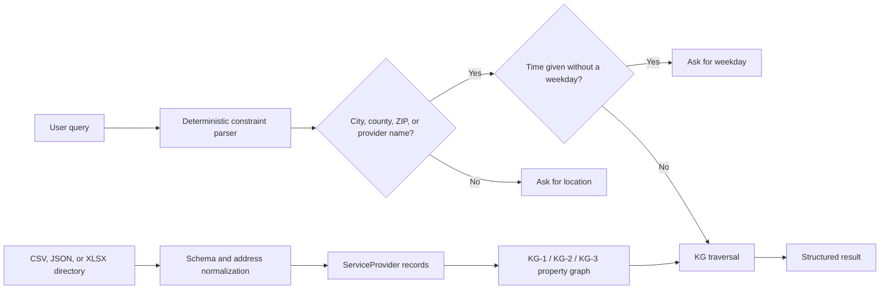

# TRACE Public-Service Retrieval Engine

TRACE is a constraint-aware retrieval engine for public-service directories.
This repository contains the constraint-aware retrieval pipeline, optional
local-LLM intent and response stages, and a Gradio chatbot:

- CSV, JSON, and XLSX ingestion with source-specific schema adapters.
- A normalized `ServiceProvider` model with backward compatibility for pantry data.
- City, state, and ZIP derivation from structured mailing addresses.
- A deterministic parser for service category, provider name, city, county, ZIP
  code, weekday, opening time, and ID-related eligibility constraints.
- Optional local Ollama classification of one or more service categories, with
  schema validation and deterministic fallback.
- Explicit knowledge graphs (KGs) with typed nodes, edges, properties, indexes, and
  graph traversal for the KG-1, KG-2, and KG-3 ablations.
- Normalization of free-form hours into day/time intervals.
- Batched candidate retrieval followed by semantic filtering.
- Location clarification when a query lacks a city, county, ZIP code, or named
  provider, plus weekday clarification when a time is supplied without a day.
- A validated 1,000-query benchmark.
- A Gradio chat interface that can run locally or create a temporary public URL.

The LLM is deliberately kept outside provider selection: the knowledge graph
retrieves grounded directory records, and the LLM classifies intent and phrases
those records conversationally.

## Architecture at a glance



## Test the retrieval framework locally

This repository currently implements the retrieval part of TRACE - no LLM!

### Requirements

You need:

- Python 3.11 or newer
- Git, unless you download the repository as a ZIP
- PowerShell for the commands below

Core retrieval has no third-party runtime dependencies. The web interface uses
the optional `ui` dependency group.

Verify Python:

```powershell
python --version
```

If Windows cannot find `python`, try:

```powershell
py -3.11 --version
```

## Launch the Gradio chatbot

Install the repository and its optional web interface from the repository root:

```powershell
py -3.11 -m pip install -e ".[ui]"
```

On the Codex Windows setup used during development, where `py` and `python` may
not be on `PATH`, install Gradio with the bundled runtime instead:

```powershell
$python = "$env:USERPROFILE\.cache\codex-runtimes\codex-primary-runtime\dependencies\python\python.exe"
& $python -m pip install gradio
```

Start a local-only chatbot:

```powershell
py -3.11 -m trace_engine.gradio_app `
  --data ".\211_Sample_Dataset.xlsx" `
  --inbrowser
```

To create a temporary public URL that anyone with the link can open, add
`--share`:

```powershell
py -3.11 -m trace_engine.gradio_app `
  --data ".\211_Sample_Dataset.xlsx" `
  --share
```

The repository also includes a launcher that finds the bundled Python and uses
the local `211_Sample_Dataset.xlsx` automatically:

```powershell
powershell -NoProfile -ExecutionPolicy Bypass `
  -File ".\scripts\start_chat.ps1" `
  -Public
```

Keep that PowerShell process and Ollama running while the link is in use. The
temporary link stops working when the process exits. For a link protected by a
username and password, add `--username "demo" --password "choose-a-password"`.

The app defaults to `qwen3.5:4b` for both multi-label classification and grounded
response generation. If Ollama is unavailable, deterministic fallbacks keep the
app usable, with less capable category interpretation.

### 1. Download the repository

```powershell
git clone https://github.com/touseefhasan/trace-public-service.git
Set-Location trace-public-service
```

You can also select **Code → Download ZIP** on GitHub, extract the ZIP, and open PowerShell in the extracted directory.

### 2. Configure the Python source path

Run this from the repository root:

```powershell
$env:PYTHONPATH = Join-Path $PWD "src"
```

This setting applies to the current PowerShell session. If you open another terminal, run it again.

### 3. Run a sample retrieval query

The repository includes fictional sample pantry data, so you can test retrieval without downloading the full dataset.

```powershell
python -m trace_engine.cli `
  --data "data/sample/pantries.csv" `
  ask "Which pantries in Sedgwick County are open Saturday at 10am?" `
  --variant kg3 `
  --limit 3
```

The JSON response should contain parsed constraints similar to:

```json
{
  "county": "Sedgwick",
  "day": "saturday",
  "open_at": "10:00"
}
```

### 4. Test a 211-style XLSX workbook

No CSV conversion is required:

```powershell
python -m trace_engine.cli `
  --data "C:\path\to\211_Sample_Dataset.xlsx" `
  ask "Where do I find shelter in Wichita?" `
  --variant kg3 `
  --limit 3
```

For this schema, TRACE reads `Category (Auto)`, derives city/state/ZIP from
`Mailing Address`, normalizes `County`, and retains the original address and
service metadata. If an address is missing, TRACE keeps the derived location
fields empty rather than inventing them.

### 5. Enter your own query manually

```powershell
$query = Read-Host "Enter your service query"

python -m trace_engine.cli `
  --data "data/sample/pantries.csv" `
  ask $query `
  --variant kg3 `
  --limit 3
```

Example questions:

```text
Which pantries are in ZIP code 67114?
Which pantries in Sedgwick County are open Saturday at 10am?
Where do I find food in Wichita?
Where do I find food in Wichita County?
I need food at 10am
```

### 6. Use the PowerShell test script

Run the included example queries:

```powershell
powershell -NoProfile -ExecutionPolicy Bypass `
  -File ".\scripts\test_retrieval.ps1"
```

Run one manual query:

```powershell
powershell -NoProfile -ExecutionPolicy Bypass `
  -File ".\scripts\test_retrieval.ps1" `
  -Query "Where do I find food in Wichita?"
```

### 7. Test with your own CSV

```powershell
python -m trace_engine.cli `
  --data "C:\path\to\your\pantries.csv" `
  ask "Which pantries in Sedgwick County are open Saturday at 10am?" `
  --variant kg3 `
  --limit 3
```

The normalized pantry CSV format uses these core columns:

```text
provider_id,name,city,county,zipcode
```

For richer service-provider schemas and column aliases, see
[data ingestion](docs/data_ingestion.md).

### 8. Inspect the knowledge graph

Print the KG-3 node and edge counts:

```powershell
python -m trace_engine.cli `
  --data "data/sample/pantries.csv" `
  graph `
  --variant kg3
```

Export the complete graph:

```powershell
python -m trace_engine.cli `
  --data "data/sample/pantries.csv" `
  graph `
  --variant kg3 `
  --output "work/kg3.json"
```

See [knowledge-graph implementation](docs/knowledge_graph.md) for the complete
node/edge schema and traversal semantics.

### Retrieval variants

| Variant | Graph constraints |
|---|---|
| `kg0` | None |
| `kg1` | Provider name, category, and location |
| `kg2` | Provider name and operating hours |
| `kg3` | Provider name, category, location, and operating hours |

For example, `Where do I find shelter in Wichita?` resolves `Wichita` as a city,
maps `shelter` to `Housing & Shelter`, intersects both graph constraints, and
then ranks the remaining services using their names and descriptive text.

See [data ingestion](docs/data_ingestion.md) for the normalized schema and
address precedence rules.

### Up next...


TRACE supports an optional local LLM at two deliberately separated stages:
multi-label category classification before retrieval and grounded chat-response
generation after retrieval. The knowledge graph—not the LLM—still selects the
providers.

### Try local multi-label intent classification

After installing [Ollama](https://ollama.com/download/windows), download the
default local model:

```powershell
ollama pull qwen3.5:4b
```

Then classify one or more service needs before KG retrieval:

```powershell
python -m trace_engine.cli `
  --data "C:\path\to\211_Sample_Dataset.xlsx" `
  ask "I need transitional housing and addiction recovery help in Wichita" `
  --variant kg3 `
  --intent-classifier ollama `
  --limit 5
```

Categories use OR semantics with each other and remain AND-constrained by
location and operating hours. If Ollama is unavailable, TRACE marks the result
as `deterministic_fallback`. See
[local LLM intent classification](docs/llm_intent_classification.md) for model,
output, and testing details.

For conversational output containing the same retrieved provider facts, use the
PowerShell wrapper's chat mode:

```powershell
powershell -NoProfile -ExecutionPolicy Bypass `
  -File ".\scripts\test_retrieval.ps1" `
  -DataPath "C:\path\to\211_Sample_Dataset.xlsx" `
  -Query "I need transitional housing and addiction recovery help in Wichita" `
  -IntentClassifier ollama `
  -ResponseStyle chat
```

TRACE validates that the generated answer retains every supplied provider fact.
If generation fails or changes a fact, it automatically uses a deterministic
chat formatter instead.
