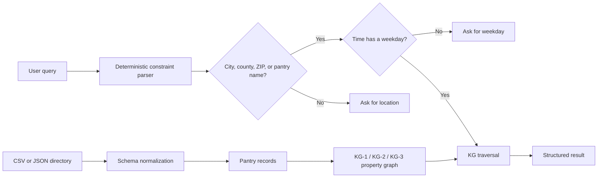

# TRACE Public-Service Retrieval Engine

TRACE is a constraint-aware retrieval engine for food-pantry (ideally, any public-service)
directories. This repository contains the implementation before LLM integration, i.e., only the 'retrieval' part:

- A deterministic parser for pantry name, city, county, ZIP code, weekday,
  opening time, and ID-related eligibility constraints.
- Explicit knowledge graphs (KGs) with typed nodes, edges, properties, indexes, and
  graph traversal for the KG-1, KG-2, and KG-3 ablations.
- Normalization of free-form hours into day/time intervals.
- Batched candidate retrieval followed by semantic filtering.
- Location clarification when a query lacks a city, county, ZIP code, or named
  provider, plus weekday clarification when a time is supplied without a day.
- A validated 1,000-query benchmark.

Why hasn't LLM been integrated yet? Well...the key aspect of the TRACE framework is the retrieval process. Retrieval is the cornerstone! LLMs (and a full-fledged chatbot!) coming soon...

## Architecture at a glance



## Test the retrieval framework locally

This repository currently implements the retrieval part of TRACE - no LLM!

### Requirements

You need:

- Python 3.11 or newer
- Git, unless you download the repository as a ZIP
- PowerShell for the commands below

Verify Python:

```powershell
python --version
```

If Windows cannot find `python`, try:

```powershell
py -3.11 --version
```

### 1. Download the repository

```powershell
git clone https://github.com/touseefhasan/trace-public-service.git
Set-Location trace-public-service
```

You can also select **Code → Download ZIP** on GitHub, extract the ZIP, and open PowerShell in the extracted directory.

### 2. Configure the Python source path

Run this from the repository root:

```powershell
$env:PYTHONPATH = Join-Path $PWD "src"
```

This setting applies to the current PowerShell session. If you open another terminal, run it again.

### 3. Run a sample retrieval query

The repository includes fictional sample pantry data, so you can test retrieval without downloading the full dataset.

```powershell
python -m trace_engine.cli `
  --data "data/sample/pantries.csv" `
  ask "Which pantries in Sedgwick County are open Saturday at 10am?" `
  --variant kg3 `
  --limit 3
```

The JSON response should contain parsed constraints similar to:

```json
{
  "county": "Sedgwick",
  "day": "saturday",
  "open_at": "10:00"
}
```

### 4. Enter your own query manually

```powershell
$query = Read-Host "Enter your pantry query"

python -m trace_engine.cli `
  --data "data/sample/pantries.csv" `
  ask $query `
  --variant kg3 `
  --limit 3
```

Example questions:

```text
Which pantries are in ZIP code 67114?
Which pantries in Sedgwick County are open Saturday at 10am?
Where do I find food in Wichita?
Where do I find food in Wichita County?
I need food at 10am
```

### 5. Use the PowerShell test script

Run the included example queries:

```powershell
powershell -NoProfile -ExecutionPolicy Bypass `
  -File ".\scripts\test_retrieval.ps1"
```

Run one manual query:

```powershell
powershell -NoProfile -ExecutionPolicy Bypass `
  -File ".\scripts\test_retrieval.ps1" `
  -Query "Where do I find food in Wichita?"
```

### 6. Test with your own CSV

```powershell
python -m trace_engine.cli `
  --data "C:\path\to\your\pantries.csv" `
  ask "Which pantries in Sedgwick County are open Saturday at 10am?" `
  --variant kg3 `
  --limit 3
```

For now, the normalized CSV format requires these columns to be present:

```text
provider_id,name,city,county,zipcode
```

### 7. Inspect the knowledge graph

Print the KG-3 node and edge counts:

```powershell
python -m trace_engine.cli `
  --data "data/sample/pantries.csv" `
  graph `
  --variant kg3
```

Export the complete graph:

```powershell
python -m trace_engine.cli `
  --data "data/sample/pantries.csv" `
  graph `
  --variant kg3 `
  --output "work/kg3.json"
```

### Retrieval variants

| Variant | Graph constraints |
|---|---|
| `kg0` | None |
| `kg1` | Pantry name and location |
| `kg2` | Pantry name and hours |
| `kg3` | Pantry name, location, and hours |

### Up next...


According to our architecture, the retrieved records are then passed along to the LLM for final response generation that goes to the user in the end. So the next step is to include the LLM pipeline and close the loop.
