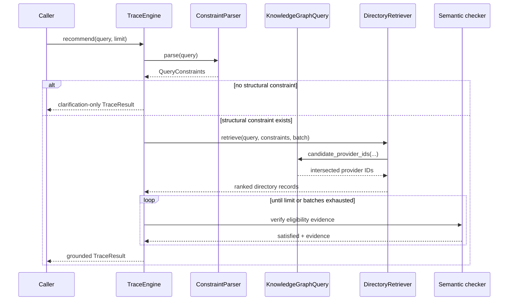

# Architecture

This document describes the implementation as it exists immediately before an
LLM is introduced. The design separates deterministic retrieval and grounding
from any future natural-language generation layer.

## End-to-end request flow

1. `ingestion.load_directory` detects the input schema and creates immutable
   `Pantry` records. Stable source IDs are preserved.
2. `ConstraintParser` extracts supported structural and semantic constraints
   from the query using directory-aware matching and regular expressions.
3. `TraceEngine` returns a clarification if the query has no pantry name,
   location, or operating-day constraint.
4. `DirectoryRetriever` uses the selected ablation. KG variants traverse the
   materialized graph and intersect matching provider-ID sets.
5. Candidate records are ranked deterministically by query-token overlap.
6. `check_semantic_constraints` verifies supported eligibility requirements
   against the provider's source text. It never converts missing evidence into
   a match.
7. Accepted records are returned as a `TraceResult` with matched constraints,
   source evidence, and stable provider data.

## Module responsibilities

| Module | Responsibility |
| --- | --- |
| `models.py` | Immutable provider, constraint, recommendation, and result models |
| `ingestion.py` | CSV/JSON schema detection, source mapping, and validation |
| `normalization.py` | Text, location, clock, weekday, and free-form-hours normalization |
| `constraints.py` | Deterministic directory-aware query parsing |
| `knowledge_graph.py` | Property-graph types, construction, indexes, traversal, and export |
| `retrieval.py` | KG ablations, candidate pagination, and deterministic ranking |
| `semantic.py` | Evidence-backed eligibility checks |
| `engine.py` | Clarification, retrieval/filter loop, and grounded result assembly |
| `evaluation.py` | Benchmark loading and aggregate metrics |
| `cli.py` | `ask`, `list`, `graph`, and `evaluate` commands |

## Data model and provenance

`Pantry` is the boundary between untrusted source shape and retrieval logic.
The adapter preserves the original provider ID, contact and location fields,
hours, eligibility text, source URL, and optional verification timestamp.
Downstream components pass full typed records rather than reconstructing facts
from text snippets.

The engine treats missing or unparseable information as unknown. For example,
an exact time query cannot match a day-only schedule edge. This conservative
rule prevents unsupported availability claims at the cost of lower recall.

## Retrieval and ranking

Exact constraints are controlled by `VARIANT_FIELDS`:

- KG-0 builds no graph and ranks every directory record.
- KG-1 graph-selects pantry-name and location matches.
- KG-2 graph-selects pantry-name and schedule matches.
- KG-3 applies all supported exact graph constraints.

Multiple exact constraints use set intersection, so a county plus Saturday at
10:00 query requires both conditions. Token overlap breaks ties and orders the
candidate set; it is not a semantic embedding.

The engine requests candidates in batches. A candidate rejected by semantic
evidence checking does not end the search: the next graph-ranked record is
examined until the requested result limit, exhaustion, or `max_batches`.

## Replaceable boundaries

The following boundaries are intentionally narrow:

- The deterministic `ConstraintParser` can be wrapped or replaced by a
  schema-constrained LLM parser.
- The in-memory `PropertyGraph` can be replaced by Neo4j or another graph store
  while preserving provider-ID traversal semantics.
- Token-overlap ranking can be augmented by embeddings without changing the
  structured filtering contract.
- A response generator can consume `TraceResult`, but must not create provider
  facts that are absent from its recommendations and evidence.

These replacements should be measured against the existing deterministic
baseline rather than silently changing its behavior.
