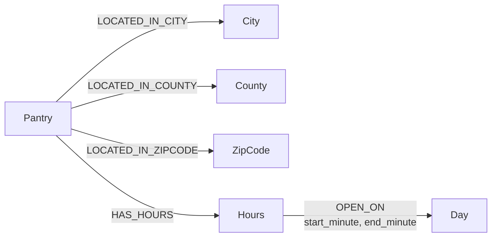

# Knowledge graph implementation

KG-1, KG-2, and KG-3 are materialized as deterministic property graphs. They
are not aliases for SQL-style filters.



## Variants

- KG-1 materializes Pantry, City, County, and ZipCode nodes plus location edges.
- KG-2 materializes Pantry, Hours, and Day nodes plus schedule edges.
- KG-3 materializes the union of KG-1 and KG-2.
- KG-0 remains the graph-free text baseline.

Structural queries resolve location or day nodes, traverse incoming typed edges
to Pantry nodes, and intersect the resulting provider-ID sets under strict AND
semantics. Text ranking runs only over the graph-selected candidates.

Hours remain evidence preserving: every Hours node stores the original scraped
text. `OPEN_ON` edges are added only when a time interval can be parsed without
guessing. This deliberately exposes the current normalization coverage instead
of treating unknown schedules as open.

On the supplied 811-row directory, 300 schedules are blank or explicitly `Not
available`. Of the remaining 511 schedules, 501 produce graph day edges (98.0%):
477 include concrete time intervals and 24 retain day-only edges because an end
time is unavailable. Ten nonempty values remain unparsed because they are dated
one-off events, lack a weekday, or contain nonschedule text in the hours field.

The resulting KG-3 contains 2,446 nodes and 4,374 edges, including 1,130
`OPEN_ON` edges.

## Inspection

Print graph counts:

```powershell
$env:PYTHONPATH = "src"
python -m trace_engine.cli --data data/sample/pantries.csv graph --variant kg3
```

Export all nodes and edges:

```powershell
python -m trace_engine.cli `
  --data data/sample/pantries.csv `
  graph --variant kg3 --output work/kg3.json
```

The embedded graph is the reference implementation used by tests and local
evaluation. A future Neo4j adapter can implement the same query interface for
deployment or interactive graph exploration.
